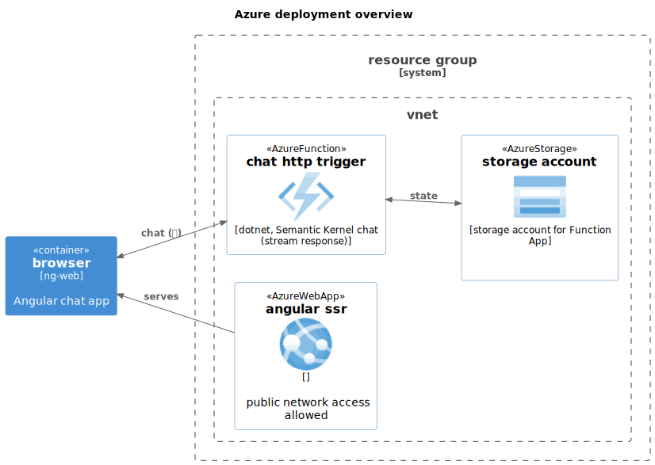

# Semantic Kernel Chat Function App + Angular app (App Service)

## Table of Contents

## Getting started

[](https://github.com/codespaces/new?hide_repo_select=true&ref=main&repo=1049031484&machine=standardLinux32gb&devcontainer_path=.devcontainer%2Fdevcontainer.json&location=WestUs2)

[](https://vscode.dev/redirect?url=vscode://ms-vscode-remote.remote-containers/cloneInVolume?url=https://github.com/JayChase/semantic-kernel-function-app)

### Deploying to Azure

Once you've opened the project in [Codespaces](#github-codespaces), or [locally](#run-locally), you can deploy it to Azure.

From a Terminal window, open the folder with the clone of this repo and run the following commands.

1. Login to Azure:

    ```shell
    azd auth login
    ```

1. Provision and deploy all the resources:

    ```shell
    azd up
    ```

    It will prompt you to provide an `azd` environment name (like "**eShopLite-AzureAISearch**"), select a subscription from your Azure account, and select a [location where Azure AI Search and the OpenAI models gpt-4o-mini and ADA-002 are available](https://azure.microsoft.com/explore/global-infrastructure/products-by-region/?products=cognitive-services&regions=all) (like "eastus2").

1. When `azd` has finished deploying, you'll see the list of resources created in Azure and a set of URIs in the command output.

## Infra



design justifications

## The function app (sk-chat)

streaming

## The Angular app (ng-web)

nothing special

## References
