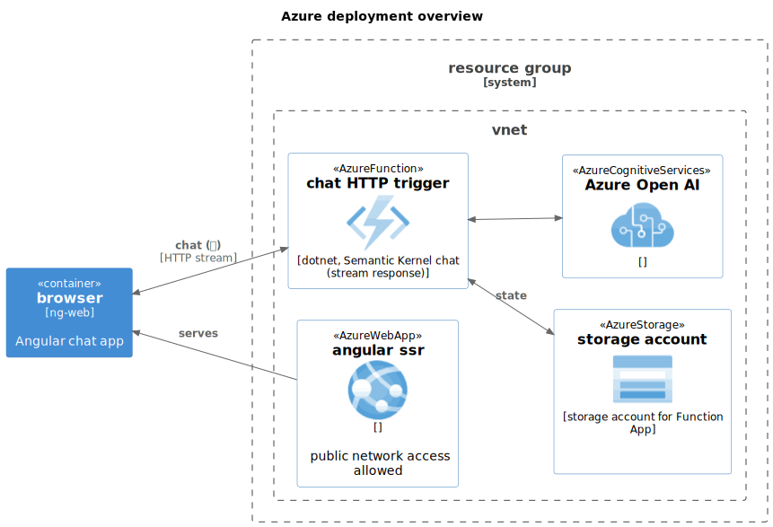
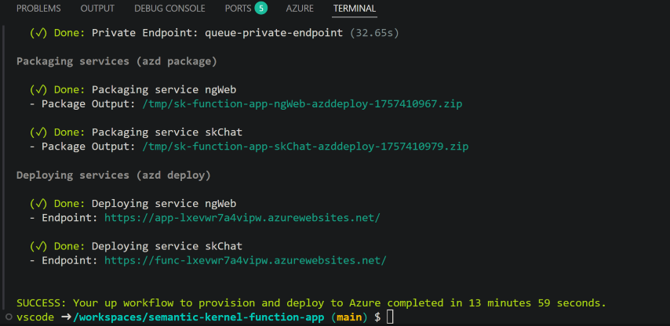
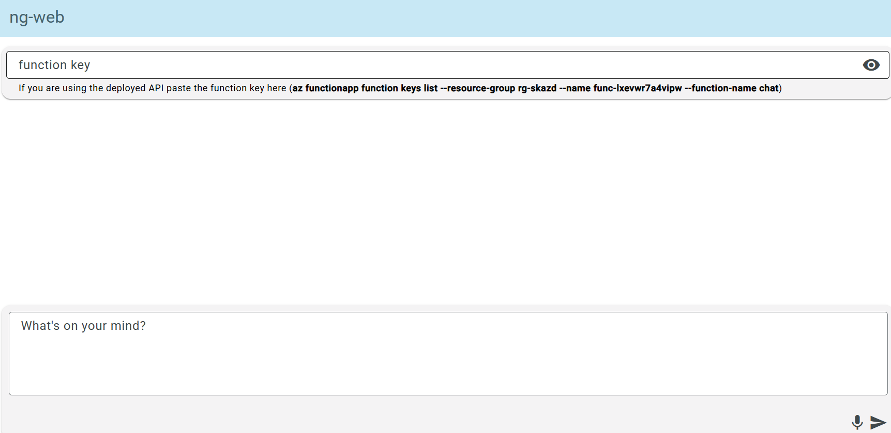
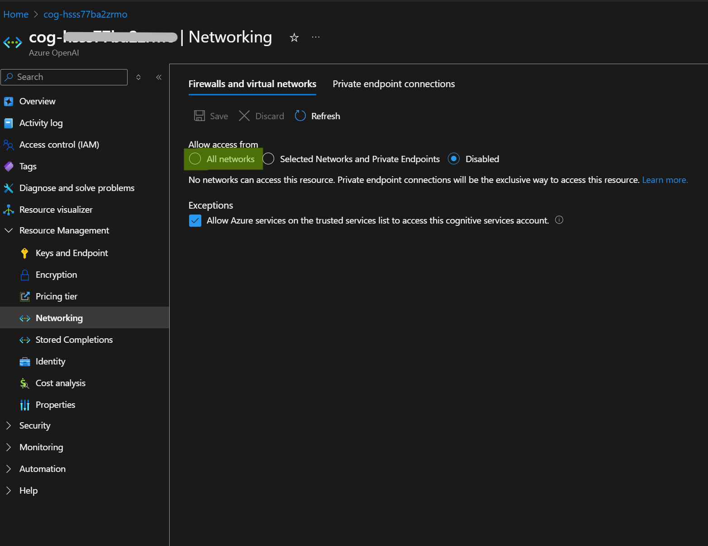

# Semantic Kernel Chat Function App + Angular 🚀

A streaming chat function app demonstrating real-time AI conversations using Azure OpenAI, Semantic Kernel, and Angular.

## Dev Container / Codespaces

[](https://vscode.dev/redirect?url=vscode://ms-vscode-remote.remote-containers/cloneInVolume?url=https://github.com/JayChase/semantic-kernel-function-app)

...then follow the [Dev container quick start](#dev-container-quick-start).

## Table of Contents

-   [Architecture](#architecture)

-   [Dev container quick start](#dev-container-quick-start)
-   [Local development](#local-development)
-   [Working with the code](#working-with-the-code)
-   [Features](#features)
-   [Services & resources](#services--resources)
-   [Streaming implementation details](#streaming-implementation-details)
-   [Security & networking](#security--networking)

## Architecture



## Dev Container Quick Start

1. Use the badge above (VS Code Dev Containers) OR create a Codespace.
2. Wait for the container build (installs Node, azd, Azure CLI, Functions Core Tools, Angular CLI, .NET 9).
3. Sign in & provision:

    ```bash
    azd auth login
    azd up
    ```

4. After deployment services has finished click on the ngWeb link



6. Copy and run the az command from the UI and run it in the terminal to get the func app key. Paste the key into the UI and start chatting.

7. Run the script to assign the **Cognitive Services User** role to the current az user in order to run the **sk-chat** function app locally (it will use the user the az user credential to access the deployed cognitive services).

```bash
#bash
sh ./infra/az-user-openai-authz.sh

#pwsh
./infra/az-user-openai-authz.ps1
```



## Local development

### Prerequisites

Core (all scenarios):

-   Azure subscription with access to Azure OpenAI (model: `gpt-4o-mini`).

-   Git.

Local machine (when NOT using the dev container):

-   Node.js 22 LTS + npm (Angular 19 + SSR build).
-   .NET 9 SDK (isolated Functions runtime).
-   Azure Functions Core Tools v4 (for `func start`).
-   Azure CLI (latest)
-   Azure Developer CLI (azd).
-   Azurite (optional)

```bash
git clone https://github.com/JayChase/semantic-kernel-function-app.git
cd semantic-kernel-function-app
azd auth login
azd up
```

Answers required during `azd up`:

-   Environment name (used to derive unique resource names)
-   Subscription
-   Primary location (location for the resource group and all resources)
-   OpenAI location (the location to deploy the cognitive services to)

## Features

-   .NET 9 isolated Azure Functions with middleware & DI.
-   Semantic Kernel + Microsoft.Extensions.AI abstraction for chat.
-   Streaming responses (SSE style) for low‑latency token display.
-   Angular SSR (Node 22 LTS) hosted on App Service.
-   Automated infra: AVM Bicep modules (App Service, Function, Storage, VNet, Private Endpoints, Azure OpenAI, Monitoring, Managed Identity).
-   User Assigned Managed Identity for Function deployment & data plane auth.
-   Strict Storage access (shared key disabled + network ACL + VNet rules).
-   Private endpoints for Azure OpenAI & Storage.
-   Application Insights + Log Analytics dashboard.

## Services & Resources

| Logical           | Azure Resource                           | Notes                                                                         |
| ----------------- | ---------------------------------------- | ----------------------------------------------------------------------------- |
| Angular Front End | App Service (Linux, B1)                  | Runs Node 22 SSR command line `node /home/site/wwwroot/server/server.mjs`     |
| Chat API          | Azure Functions (Flex Consumption FC1)   | .NET 9 isolated, streaming chat endpoint `/api/chat`                          |
| AI                | Azure OpenAI (S0)                        | Deployment of `gpt-4o-mini` (capacity 15) with public network access disabled |
| Identity          | User Assigned Managed Identity           | Attached to Function for Storage + OpenAI RBAC                                |
| Storage           | Storage Account (LRS)                    | Blob container for Function deployment, network restricted                    |
| Networking        | VNet + subnets + Private Endpoints       | For Storage + Azure OpenAI private ingress                                    |
| Monitoring        | App Insights + Log Analytics + Dashboard | Provided via AVM monitoring pattern module                                    |

## Working with the code

1. Run `azd up` so the open Azure OpenAI service is available.
2. Start azurite **ctrl + shift + p** then **Azurite: start**
3. Start debugging the function app **F5**
4. Run the Angular app:

```bash
cd ng-web
ng s --ssl --host localhost
```

ℹ️ if you are running local ensure that the [Angular CLI](https://angular.dev/tools/cli#) is installed `npm install -g @angular/cli`

ℹ️ use --host so you can open https://localhost:4200 in your local browser.

### Accessing Azure OpenAI from your local machine

The Azure OpenAI resource provisioned by `azd up` has **public network access disabled** and is reachable only through its private endpoint inside the VNet. If you run the **Function locally** (so the call to Azure OpenAI originates from your machine) you can temporarily enable full public network access or enable public access for your current IP in the portal



The logged in az user is assigned the **Cognitive Services User** role as part of the provisioning. These credentials will be used by the sk-chat function app running locally to access the deployed cognitive services instance. If you need to use another account see the [az-user-openai-authz.sh](./infra/az-user-openai-authz.sh) script to get the az command.

## Streaming Implementation Details

-   The function uses proper Server-Sent Events (SSE) framing, setting `Content-Type: text/event-stream`. Each message is sent as a `data:` field, followed by two newlines. The stream is terminated with a final `event: done`.
-   Uses `IChatClient.GetStreamingResponseAsync` from Microsoft.Extensions.AI (Semantic Kernel integration) with optional future hook for tool/function calling (`FunctionChoiceBehavior.Auto()`).
-   SSE reconnection/backpressure handled client side (not implemented here yet—consider exponential backoff & abort controller).

## Security & Networking

-   Azure OpenAI `publicNetworkAccess: Disabled`; access only via private endpoint + RBAC.
-   Storage account shared key disabled; Function deploy uses user-assigned identity + blob container deployment method.
-   VNet integration applied to Function (subnet injection) + private endpoints for OpenAI & Storage.
-   CORS on Function allows portal + web app hostname only (see `siteConfig.cors`).
-   Secrets avoided in source; identity & RBAC preferred. (OpenAI key parameter exists but not used in runtime binding—future fallback.)

## Contributing

PRs welcome. Validate formatting & run `azd package --all` before submitting.

## License

See [LICENSE](./LICENSE).

---

Generated with reference to project source, infrastructure templates & azd best practices.

[PR for Awesome AZD contribution](https://github.com/Azure/awesome-azd/pull/643)
